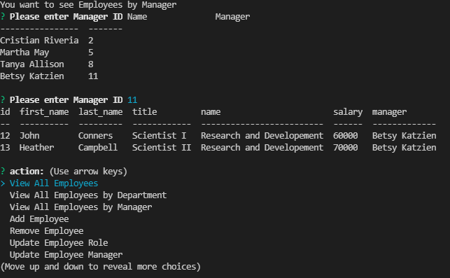

# 12-employee-tracker
The Week 12 homework

1.0  Title: Employee Tracker

2.0 Introduction:
    The goal of this week's homework was using node.js, inquirer, express.js, mysql2 to create a command line interface
    which would allow the user to pull from a database. The data was separated into 3 different tables, employees, 
    roles, and departments, the information the user will pull wil combine the tables using join.

3.0 Technologies
    This was node.js, and using mySQL. There is also npm: express, and console.table.

4.0 Launch:
    The repo is located at: https://github.com/speakeasyman/12-employee-tracker  
    The video can be found here: https://youtu.be/eMmruiZvL1c

5.0 My Goals: 
    To practice the using mySQL and joining tables, and working on making more complex command line interfaces.
    Future plans will be to practice how to make the lines more modular and clean up. I should be able to have a function
    return an array to populate the choices, but I couldn't quite get it right.

6.0 In use:  

You can launch the file with 'node server.js', and you'll see the prompts  

 

If you select the view all, you'll see the joined table. Here is all of the employees  

 

You can even search by the manager. When that is selected, the system will pregenerate 
a table of all the managers and their id so you may enter the desired one into the input field

And so much more. Please watch the video to see a full demonstration!
